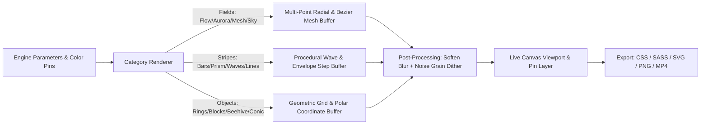

# Technical Architecture & Implementation Spec: Theme Builder Studio & Atmospheric Gradient Engine

- **Spec Path:** `PRODUCT-TECH.md`
- **Product Spec Reference:** [`PRODUCT.md`](./PRODUCT.md) & [`specs/2026-08-16-theme-and-gradient-studio.md`](./specs/2026-08-16-theme-and-gradient-studio.md)
- **Commit Baseline:** [`c39d16a0ab38a4e8d6e4f212dbe044cb2031b120`](https://github.com/fractalmandala/fractalthemer/commit/c39d16a0ab38a4e8d6e4f212dbe044cb2031b120)
- **Author:** Antigravity Engineering

---

## 1. Context & Existing System

`fractalthemer` is a Svelte 5 library providing 42 curated light/dark themes, 203 atmospheric GPU gradient blend presets, an off-canvas drawer (`ThemePicker.svelte`), and a zero-flicker SSR hydration mechanism.

### Key Existing Modules & Entry Points
- [`src/lib/state/theme.svelte.ts:1-120 @ c39d16a`](https://github.com/fractalmandala/fractalthemer/blob/c39d16a/src/lib/state/theme.svelte.ts#L1-L120) — The Svelte 5 reactive Runes state singleton managing active `mode`, `theme`, `bgStyle`, `activeAura`, `activeGradient`, and custom token overrides via `localStorage`.
- [`src/lib/components/ThemePicker.svelte:1-250 @ c39d16a`](https://github.com/fractalmandala/fractalthemer/blob/c39d16a/src/lib/components/ThemePicker.svelte#L1-L250) — The 100vh responsive right sliding drawer housing themes, auras, and gradient samplers.
- [`src/lib/components/AuraBackground.svelte:1-40 @ c39d16a`](https://github.com/fractalmandala/fractalthemer/blob/c39d16a/src/lib/components/AuraBackground.svelte#L1-L40) — GPU blend backdrop renderer fixed at `z-index: -1` with `pointer-events: none`.
- [`src/lib/styles/_tokens.sass:1-35 @ c39d16a`](https://github.com/fractalmandala/fractalthemer/blob/c39d16a/src/lib/styles/_tokens.sass#L1-L35) — The 22 semantic color tokens contract defining application base surfaces, borders, states, and accents.

---

## 2. Proposed Changes & Module Topology

We are introducing the **Theme Studio** sub-system into `src/lib/components/studio/`, modular engine calculators in `src/lib/engines/`, datasets in `src/lib/data/`, and single-tab indented SASS styling in `src/lib/styles/_studio.sass` and `_palette-gen.sass`.

```
src/lib/
├── components/
│   ├── studio/
│   │   ├── ThemeStudio.svelte        # Master Studio container modal & navigation
│   │   ├── GradientCanvas.svelte     # 60fps Canvas2D/WebGL renderer with draggable pins
│   │   ├── GeneratorControls.svelte  # 21-engine parameter sliders & presets
│   │   ├── PaletteGenerator.svelte   # 9-column semantic theme palette generator with locking
│   │   ├── GalleryView.svelte        # 70+ preset gradient gallery browser
│   │   ├── PaletteCatalog.svelte     # Searchable artisan color explorer with WCAG badges
│   │   ├── SavedView.svelte          # Persistent local storage library
│   │   ├── TimelineBar.svelte        # Multi-band color reach distribution slider
│   │   └── ExportModal.svelte        # CSS, SASS, SVG, PNG, Shader, JSON & MP4 export
│   ├── ThemePicker.svelte            # Added "Studio" launcher button
│   └── AuraBackground.svelte         # Runtime shader backdrop integration
├── engines/
│   ├── color-harmony.ts              # Harmony algorithms (analogous, triadic, etc.) & contrast
│   ├── color-converter.ts            # Hex ↔ RGB ↔ HSL ↔ OKLCH math
│   ├── fields-renderer.ts            # Flow, Sky, Aurora, Mesh, Still, Retro, iOS math
│   ├── stripes-renderer.ts           # Linear, Stripes, Bars, Columns, Prism, Waves, Lines math
│   ├── objects-renderer.ts           # Rings, Pixel, Blocks, Beehive, Balls, Radial, Conic math
│   └── video-exporter.ts             # Canvas MediaRecorder / WebCodecs MP4 pipeline
├── data/
│   ├── gallery-presets.ts            # 70+ Curated gradient studies
│   ├── artisan-colors.ts             # Curated designer/Japanese color library
│   └── studio-presets.ts             # Default presets for all 21 engines
├── state/
│   └── studio.svelte.ts              # Reactive state for active studio recipe & palette
└── styles/
    ├── _studio.sass                  # Studio layout, canvas pins, floating bars
    ├── _palette-gen.sass             # 9-column lockable palette styles & contrast badges
    └── index.sass                    # Exported bundle
```

---

## 3. Detailed Component & Engine Specifications

### 3.1. 9-Column Semantic Theme Palette Generator (`PaletteGenerator.svelte` & `color-harmony.ts`)

#### Semantic Column Mapping
1. `--bg`: Canvas deepest backdrop
2. `--bg-surface`: Card surface
3. `--bg-panel`: Sidebar & toolbar panel
4. `--bg-raised`: Elevated dropdown/modal
5. `--state-hover`: Neutral hover state
6. `--state-hover-subtle`: Gentle list-item hover state
7. `--border`: Standard border & outline
8. `--theme-color`: Primary brand accent
9. `--theme-color-alt`: Brand hover/focus state

#### Per-Column State Contract
```typescript
export interface PaletteColumnState {
    token: string;
    label: string;
    hex: string;
    hsl: { h: number; s: number; l: number };
    locked: boolean;
    contrastWhite: number; // e.g. 1.22
    contrastBlack: number; // e.g. 17.24
    contrastBg: number;    // against active --bg
}
```

#### Harmony & Locking Algorithm (`color-harmony.ts`)
- When the user clicks **Randomize** or switches Harmony modes (`monochromatic`, `analogous`, `complementary`, `split-comp`, `triadic`, `tetradic`, `shades`, `tints`):
  - Any column with `locked === true` **preserves its exact hex/hsl values**.
  - Unlocked columns are regenerated based on the active base color (or first locked color if base is locked) according to the mathematical angle offsets:
    - *Analogous*: $H \pm 30^\circ$
    - *Complementary*: $H + 180^\circ$
    - *Split-Complementary*: $H + 150^\circ, H + 210^\circ$
    - *Triadic*: $H + 120^\circ, H + 240^\circ$
    - *Tetradic*: $H + 90^\circ, H + 180^\circ, H + 270^\circ$
    - *Shades/Tints*: Preserves $H, S$, steps $L$ across $[10\%, 95\%]$ calibrated for surface elevation.

---

### 3.2. 21-Engine Shader & Canvas Pipeline (`GradientCanvas.svelte`)

The canvas utilizes a 60fps high-DPI `Canvas2D` and WebGL compositing pipeline:



#### Pin & Timeline Interaction Contract
- **Canvas Pins**: Rendered as interactive SVG/DOM overlays directly over the canvas with pointer event capture for smooth dragging.
- **Ring Handles**: Radius calculation `dist(pointer, pinCenter)` updates the color emitter reach parameter.
- **Timeline Distribution**: Multi-stop slider maps segment widths $w_i = \frac{reach_i}{\sum reach} \times 100\%$, allowing direct proportion adjustment.

---

### 3.3. Multi-Format Export Pipeline (`ExportModal.svelte` & `video-exporter.ts`)

1. **CSS Generator**: Formats pure CSS `background: linear-gradient(...)`, multi-radial layers, or CSS variables.
2. **SASS Generator**: Formats single-tab indented `.sass` variables:
   ```sass
   $bg: #ffffff
   $bg-surface: #f8f9fa
   $theme-color: #04825b
   ```
3. **SVG Generator**: Creates standalone XML SVG with `<defs><linearGradient>...` or `<radialGradient>` and `<filter id="noise">`.
4. **PNG Generator**: `canvas.toBlob('image/png')` rendered at 1x, 2x, or 4x pixel density.
5. **MP4 Video Recorder**: Uses `canvas.captureStream(60)` and `MediaRecorder` with `video/mp4; codecs=avc1.42E01E,mp4a.40.2` (or `video/webm` fallback) to record an animated 3-second seamless loop.

---

## 4. Testing & Validation Plan

Each numbered Behavior invariant from `PRODUCT.md` is validated:

| Invariant | Test Target | Verification Method |
|---|---|---|
| **3.1-3.3: 21 Generator Engines** | `GradientCanvas.svelte` | Automated render test across all 21 types with 0 errors; visual canvas smoke test. |
| **3.3: Canvas Pin Dragging** | `GradientCanvas.svelte` | Pointer down, drag, pointer up events update coordinates in `studioState` at 60fps. |
| **3.4: 9-Column Palette Mapping** | `PaletteGenerator.svelte` | Verifies all 9 semantic tokens are rendered with valid hex and contrast scores. |
| **3.4: Per-Color Locking** | `color-harmony.ts` | Unit test: lock column index 0 & 7; trigger `randomize()` 100 times; verify locked columns never mutate. |
| **3.5: 70+ Gallery Presets** | `gallery-presets.ts` | All 70+ presets load into `studioState` without undefined properties. |
| **3.5: Palette Explorer** | `artisan-colors.ts` | Search substring filter and sort by Hue/Luminance return correct sorted arrays. |
| **3.6: Multi-Format Export** | `ExportModal.svelte` | Validates generated CSS, SASS, SVG, PNG, and JSON strings against test fixtures. |
| **Zero Regressions on Themer** | `ThemePicker.svelte` | `pnpm run check && pnpm run package` passes with 0 errors/warnings. |
| **Kit Consumer Verification** | `acrolls/examples/kit-consumer` | `pnpm run check && pnpm run build` succeeds without SASS or SSR errors. |

---

## 5. Implementation Sequencing

We will execute the implementation sequentially across 6 focused milestones:

1. **Milestone 1: Mathematical Foundations & Color Harmony**
   - Create `color-converter.ts`, `color-harmony.ts` (8 harmony algorithms, WCAG contrast ratio calculations, per-swatch locking engine).
   - Create `artisan-colors.ts` and `tokens.ts` mappings.
2. **Milestone 2: 9-Column Lockable Palette Generator**
   - Build `PaletteGenerator.svelte` and `_palette-gen.sass` (9 semantic columns, interactive locks, live contrast badges, harmony selector, randomize/reset buttons, and *"Apply as Active Theme"* action).
3. **Milestone 3: 21 Gradient Generator Engines & Shaders**
   - Build `fields-renderer.ts`, `stripes-renderer.ts`, `objects-renderer.ts`.
   - Build `GradientCanvas.svelte` with high-DPI 60fps rendering, draggable canvas pins, ring reach handles, and `TimelineBar.svelte`.
4. **Milestone 4: Studio UI, Presets & Catalogs**
   - Build `ThemeStudio.svelte`, `GeneratorControls.svelte`, `GalleryView.svelte` (70+ presets), `PaletteCatalog.svelte`, `SavedView.svelte`, and `_studio.sass`.
5. **Milestone 5: Multi-Format Export Engine**
   - Build `ExportModal.svelte` (CSS, single-tab SASS, SVG, PNG 1x/2x/4x, WebGL shader, JSON, and client MP4 loop recorder).
6. **Milestone 6: Packaging, Verification & Documentation**
   - Connect Studio launcher in `<ThemePicker />` and export `ThemeStudio` in `src/lib/index.ts`.
   - Run `svelte-check`, build, package, and verify in consumer projects.
