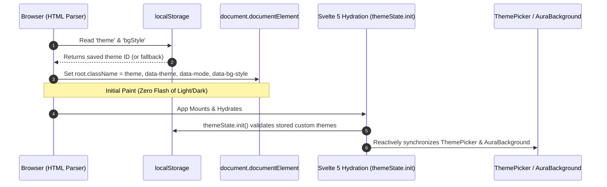

# System Architecture & Package Design

This document details the architectural topology, design philosophy, and module decomposition of the `fractalthemer` library.

---

## 🎯 Design Principles

1. **Orthogonal Mode & Palette Axes**:
   - `data-mode="light|dark"` defines the binary operating system contrast axis.
   - `data-theme="<name>"` defines the aesthetic color identity.
   - `data-bg-style="plain|aura"` controls the backdrop rendering mechanism.
   - Any theme can seamlessly switch between plain distraction-free backgrounds and immersive GPU-blended gradient auras without mutating its semantic tokens.

2. **Zero Runtime Styling Overhead**:
   - Every theme is compiled to standard, pure CSS custom properties (`--bg`, `--text-primary`, `--theme-color`, etc.).
   - Switching a theme merely toggles a single class name on `<html>` (`document.documentElement`). No JavaScript virtual DOM trees are recalculated to repaint colors.

3. **True Zero-Flicker SSR Support**:
   - A synchronous inline snippet executes in `app.html` before any stylesheet or markup renders.
   - Dark mode users never experience a white flash on initial page load or page reloads.

4. **Self-Contained Library Surface**:
   - Embedded SVG icons with zero external icon package dependencies.
   - Works with vanilla CSS, SASS, Tailwind, or any UI framework that consumes CSS custom properties.

---

## 🏗 Package Topology

The package is built with `@sveltejs/package` and exports both modern TypeScript declarations and precompiled CSS bundles:

```
fractalthemer/
├── dist/                              # Compiled distributable
│   ├── index.js                       # Svelte 5 component & state exports
│   ├── index.d.ts                     # Type definitions
│   ├── styles/
│   │   ├── index.css                  # Precompiled CSS bundle
│   │   ├── _tokens.sass               # Source SASS tokens
│   │   ├── _themes.sass               # Source SASS themes
│   │   ├── _auras.sass                # Source SASS auras
│   │   └── _theme-picker.sass         # Source SASS drawer
│   └── utils/
│       └── anti-flicker.js            # Standalone SSR script generator
└── src/lib/                           # Source files
    ├── components/                    # Svelte 5 components
    ├── state/                         # Reactive runes state
    ├── data/                          # 42 Theme & Aura definitions
    ├── icons/                         # Embedded SVG icons
    └── styles/                        # Indented SASS source
```

---

## 🔌 Export Contracts

In [`package.json`](file:///Users/amrit/fractalmandala/fractalthemer/package.json), the package defines clear subpath exports:

| Export Specifier | Resolved Target | Purpose |
|---|---|---|
| `fractalthemer` | `./dist/index.js` | Components, `themeState`, types, and constants |
| `fractalthemer/styles.css` | `./dist/styles/index.css` | Precompiled, drop-in CSS stylesheet |
| `fractalthemer/styles/*` | `./dist/styles/*` | Raw SASS stylesheets for custom compilation |
| `fractalthemer/script` | `./dist/utils/anti-flicker.js` | Standalone script generator for SSR templates |

---

## 🔄 Lifecycle & Execution Flow



---

## 🔗 Related Documents

- [State & Reactivity](file:///Users/amrit/fractalmandala/fractalthemer/docs/architecture/02-state-and-reactivity.md)
- [Tokens & CSS Contract](file:///Users/amrit/fractalmandala/fractalthemer/docs/architecture/03-tokens-and-css-contract.md)
- [Quickstart Guide](file:///Users/amrit/fractalmandala/fractalthemer/docs/guides/01-quickstart.md)
