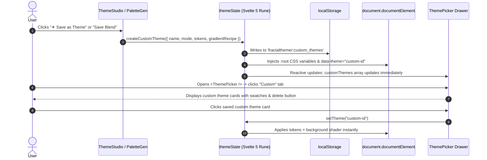

# Technical Architecture Specification: Custom Theme & Background Persistence, LocalStorage Hydration & Drawer Integration

- **Document:** `docs/specs/2026-08-16-custom-themes-and-storage-tech-spec.md`
- **Target Repository:** `fractalthemer` (`0eeaabe`)
- **Status:** Proposed Technical Specification

---

## 1. Context

`fractalthemer` allows users to generate procedural atmospheric gradients via `<ThemeStudio />` and 9-column semantic color suites via `<PaletteGenerator />`. 

Currently:
1. Palette generator applies tokens directly to the live DOM using `themeState.setCustomTokens()`, but does not save named custom themes into `themeState.customThemes` for selection later in `<ThemePicker />`.
2. Gradient studio saves recipes into `localStorage['fractalthemer:saved_studio_recipes']`, but these recipes are isolated to the Studio's **Saved** tab and not automatically surfaced in the master `<ThemePicker />` drawer under the **Custom** or **Gradients** tabs.
3. The Anti-Flicker SSR script (`anti-flicker.ts`) synchronously reads `localStorage.getItem('theme')`, but needs full support for synchronously rehydrating user-saved custom token maps (`localStorage.getItem('customTokens')`) and procedural background recipes on page reload before DOM paint.

### Relevant Code References
- [`src/lib/state/theme.svelte.ts:15-180 @ 0eeaabe`](file:///Users/amrit/fractalmandala/fractalthemer/src/lib/state/theme.svelte.ts#L15-L180): Core theme state, `customThemes` array, and token injection.
- [`src/lib/state/studio.svelte.ts:60-220 @ 0eeaabe`](file:///Users/amrit/fractalmandala/fractalthemer/src/lib/state/studio.svelte.ts#L60-L220): Studio recipe persistence and `saveCurrentRecipe()`.
- [`src/lib/components/ThemePicker.svelte:60-120 @ 0eeaabe`](file:///Users/amrit/fractalmandala/fractalthemer/src/lib/components/ThemePicker.svelte#L60-L120): Off-canvas drawer tabs (`All`, `Light`, `Dark`, `Auras`, `Gradients`, `Custom`).
- [`src/lib/utils/anti-flicker.ts:1-60 @ 0eeaabe`](file:///Users/amrit/fractalmandala/fractalthemer/src/lib/utils/anti-flicker.ts#L1-L60): SSR anti-flicker script injector.

---

## 2. Proposed Changes & Architecture

### 2.1. Unified Persistence Schema & LocalStorage Keys

All custom user data is stored in the browser's `localStorage` using namespaced keys:

| Key | Type | Purpose |
|---|---|---|
| `fractalthemer:custom_themes` | `CustomThemeEntry[]` | Array of named custom theme suites (9 tokens + metadata). |
| `fractalthemer:saved_studio_recipes` | `StudioRecipe[]` | Array of custom procedural gradient blend recipes. |
| `theme` | `string` | ID of the active theme (e.g. `custom-sunset-gold` or `theme-nord-dark`). |
| `mode` | `'light' \| 'dark'` | Binary active color scheme mode. |
| `bgStyle` | `'plain' \| 'aura' \| 'gradient' \| 'studio'` | Active background mode. |
| `customTokens` | `Record<string, string>` | Active custom CSS custom properties (`--bg`, `--border`, etc.). |
| `activeStudioRecipe` | `StudioRecipe` | Active procedural gradient currently driving `<AuraBackground />`. |

---

### 2.2. Data Flow & End-to-End Lifecycle



---

### 2.3. Concrete Code Changes

#### A. State Machine Upgrades (`theme.svelte.ts`)
1. **`saveCustomTheme(name: string, tokens: Record<string, string>, mode: 'light' | 'dark', recipe?: StudioRecipe): CustomThemeEntry`**:
   - Checks for existing theme with the same name (case-insensitive deduplication).
   - Generates ID `custom-${slugify(name)}`.
   - Persists into `localStorage['fractalthemer:custom_themes']`.
   - Updates `themeState.customThemes` reactive array so `<ThemePicker />` reflects the new theme instantly.
2. **`deleteCustomTheme(id: string)`**:
   - Removes theme from `customThemes` array and updates `localStorage`.
   - If the active theme was the deleted one, resets to default theme (`theme-light-default`).
3. **`init()` Synchronization**:
   - Synchronously loads `localStorage['fractalthemer:custom_themes']` on mount.
   - If active theme is custom, reads `customTokens` and rehydrates `document.documentElement.style`.

#### B. Anti-Flicker SSR Script (`anti-flicker.ts` & `src/app.html`)
Update the inline anti-flicker script so that if `saved` begins with `custom-` or `customTokens` exists:
```javascript
try {
  var customTokens = localStorage.getItem('customTokens');
  if (customTokens) {
    var parsed = JSON.parse(customTokens);
    for (var key in parsed) {
      root.style.setProperty('--' + key, parsed[key]);
    }
  }
} catch (e) {}
```
This guarantees **zero flash of unstyled content** when reloading a custom theme.

#### C. `<ThemePicker />` Custom Tab Upgrades
1. Under the **Custom** tab:
   - Displays all user-created themes with color swatches (`--bg`, `--border`, `--theme-color`).
   - Displays a **"➕ Create New in Studio"** card that opens `<ThemeStudio />`.
   - Each custom card has a delete (`✕`) button with confirmation.
2. Under the **Gradients** tab:
   - Surfacing user-saved Studio gradient recipes in a dedicated **"Your Custom Blends"** section at the top.

#### D. `<PaletteGenerator />` & `<ThemeStudio />` Push Flow
1. In `<PaletteGenerator />`:
   - Replace generic "Apply" with **"✦ Save & Apply Theme"**:
   - Opens a clean inline naming prompt (*e.g. "Emerald Sunset"*).
   - Saves to `customThemes`, applies to live DOM, and triggers toast `"Saved custom theme 'Emerald Sunset'!"`.
2. In `<ThemeStudio />`:
   - Top action bar includes **"✦ Use in Theme"**:
   - Instantly packages the active gradient + complementary semantic tokens into a custom theme.

---

## 3. Testing and Validation Plan

| Verification Step | Execution Method | Expected Result |
|---|---|---|
| **1. Save Custom Theme** | In `<PaletteGenerator />`, generate palette, click *"✦ Save & Apply Theme"*, enter name "Amber Glass". | Saved to `customThemes`, CSS tokens injected into `:root`, toast appears. |
| **2. Deduplication** | Save another theme with name "Amber Glass". | Overwrites existing "Amber Glass" without creating duplicate cards. |
| **3. Drawer Integration** | Open `<ThemePicker />` -> click **Custom** tab. | "Amber Glass" appears as a selectable theme card with correct swatches. |
| **4. SSR Anti-Flicker** | Set active theme to "Amber Glass", hard refresh browser (`⌘ ⇧ R`). | Page loads with custom colors applied synchronously before paint (no flicker). |
| **5. Delete Custom Theme** | In `<ThemePicker />` Custom tab, click `✕` on "Amber Glass". | Removed from `customThemes` and `localStorage`; falls back cleanly to default. |
| **6. Compilation** | `pnpm run check && pnpm run package` | **0 errors, 0 warnings**. |

---

## 4. Parallelization

- **Execution**: Single-agent sequential implementation.
- **Rationale**: The state management (`theme.svelte.ts`), SSR script (`anti-flicker.ts`), and drawer component (`ThemePicker.svelte`) share exact token schema and storage keys.
